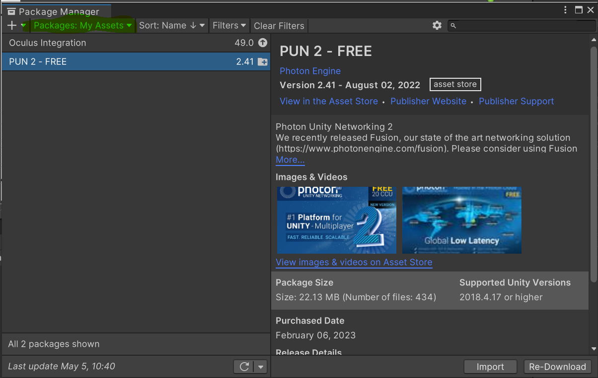
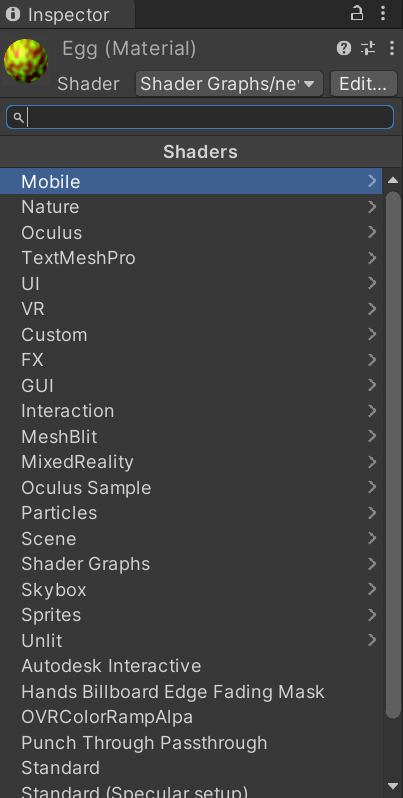
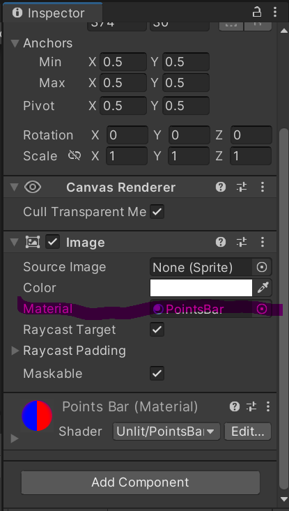
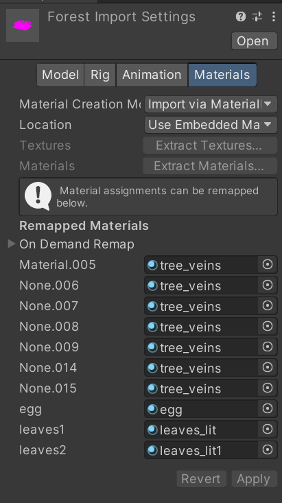

# Polo Setup

### 1) Install VS Extentions

Open Visual Studio Installer application.
Click modify on the most resent Visual Studio installation.
Install Azure development and Game Development with Unity

### 2) Get the latest NuGet packages of libraries:

Open the NewBodyTracking project in Unity.
If prompted to "open in safe mode" press ignore

Either:

Open the Visual Studio Solution associated with this project.
If there is no Visual Studio Solution yet you can make one by opening the Unity Editor
and selecting one of the csharp files in the project and opening it for editing.

Or:
In the project tab under Assets > Scripts double click a file to open it in Visual Studio
If it does not open in Visual Studio go to Edit > Preferences > External Tools > External Script Editor and click Visual Studio in the dropdown.
If there is no Visual Studio Solution yet you can make one by opening the Unity Editor
and selecting one of the csharp files in the project and opening it for editing.

In Visual Studio:
Select Tools > NuGet Package Manager > Package Manager Console

On the command line of the console at type the following command:

`Install-Package Microsoft.Azure.Kinect.BodyTracking`

### 3) Next Move the files:

**Run the batch file MoveLibraryFile.bat** in the NewBodyTracking directory.

### 4) Install all required Packages:

#### 4.1) Install From Asset Store

First visit this link and download the [Oculus Intergration](https://assetstore.unity.com/packages/tools/integration/oculus-integration-82022) package.
Second visit this link and download the [PUN 2 - Free](https://assetstore.unity.com/packages/tools/network/pun-2-free-119922) package.

#### 4.2) Setup Packages in Project

In Unity please go to Window > Package Manager and press the dropdown in the top left

Please click My Assets in the dropdown, there should be Oculus Intergration in the list of available packages, click this and then click import on the bottom right of the screen. 
If prompted:
- To install a new version of Oculus, press yes. 
- To use OpenXR backend, please press use OpenXR.
- To restart Unity press restart.
- To update Spatilizer plugins press upgrade.
Repeat this for PUN 2 - Free

Next click the dropdown again and select Unity Registry 
Type "Shader Graph" into the search bar in the top right and import it.

### 5) Problems With Materials

Under Assets > Scenes double click Kinect4AzureSampleScene to open the correct scene.

If the scene is completely pink then there was an error importing the materials

#### 5.1) Reset materials
Open on Assets > Materials in the Unity editor and click on the material labled egg.

Then click the shader dropdown (top middle of the inspector), click on Shader Graph > new_egg to apply the correct shader.
Repeat this for leaves_lit, leaves_lit1 and tree_veins but using the shaders new_leaves_lit, new_leaves_lit and new_tree_vein.

Click on the PointsBar material and apply the shader Unlit > PointsBar.

Click on star sky material and drag and drop the space-galaxy-background.jpeg to the Sperical (HDR) parameter

Click on the ClawMaterial material and drag and drop the scales texture into the square next to the albedo field.

#### 5.2) Applied Reset Materials

For the PointsBar material: In the scene view click Canvas > pointsImage, in its inspector drag and drop the PointsBar material to the materials parameter of the Image Component.

For the forest scene: Please click Assets > Model > forest, then open the materials tab at the top of the inspector view. Drag and drop the egg, leaves1 and leaves2 materials to their respective parameters and the tree_vein material to every other parameter. Then click Apply.

For the skybox: Click on Window > Rendering > Lighting then click on Environment and drag and drop the star sky material to the Skybox Material parameter

For the Marco model, go into Assets > Resources > Marco. Drag the ClawMaterial onto the "arm" meshes under claw-left and claw-right.

### 6) Play

Connect the Azure Kinect Cameras to the Computer, 
Press play.

If you find `catching exception for background thread result = K4A_RESULT_FAILED` error in the console it means the Kinects are not connected to the computer properly. Press play again and re-seat the Kinect cables, then press play again.

### Finally if you Build a Standalone Executable:

You will need to put [required DLLs for ONNX Runtime execution](https://docs.microsoft.com/en-us/azure/kinect-dk/body-sdk-setup#required-dlls-for-onnx-runtime-execution-environments) in the same directory with the .exe:

You can copy ONNXRuntime and DirectML files from nuget package by hand or from sample_unity_bodytracking directory after running **the batch file MoveLibraryFile.bat** (Step #3)
